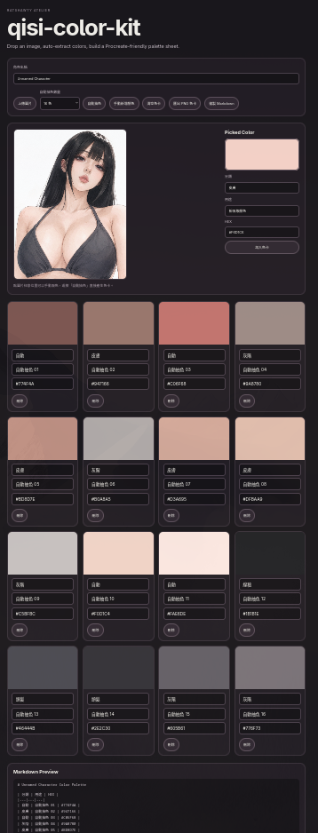

# qisi-color-kit

A Procreate-friendly image color sampler and automatic palette sheet generator for illustrator workflows.

## Preview

## What this is

qisi-color-kit helps artists upload an image, automatically extract main colors from it, manually sample specific pixels, label those colors, and export a clean palette sheet for Procreate color picking.

Workflow:

image reference -> auto extract colors -> manually refine labels -> export PNG sheet -> Procreate color picking -> finished illustration

## Features

- Upload an image
- Automatically extract 8 / 12 / 16 / 24 main colors
- Click the image to sample exact pixel colors
- Semi-automatic Label Assist for skin / hair / clothing / lineart categories
- Adjustable Label Assist strength: strict / normal / loose
- Automatic swatch naming by category and lightness
- Labelled color swatches
- Editable category / name / HEX fields
- Drag-and-drop swatch sorting
- Automatic swatch sorting by category, lightness, and hue
- One-click HEX copy
- Undo / redo palette editing
- LocalStorage autosave
- Project JSON import / export
- Compact / large palette density modes
- Custom PNG export layout: white / dark background, 4 / 6 columns, full / HEX-only / no-text labels
- PNG palette export for Procreate color picking
- Markdown export
- GitHub Pages live demo

## Status

MVP with image color sampling and automatic palette extraction.

## Identity

ratshawty / Qisi  
artist tool  
Procreate workflow
